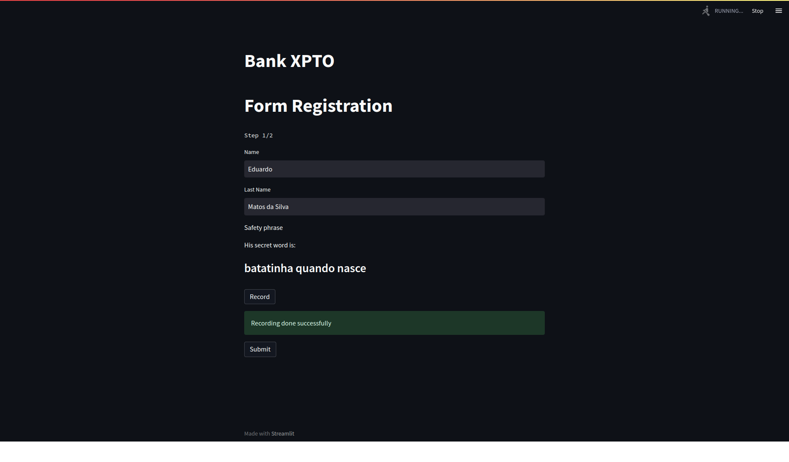
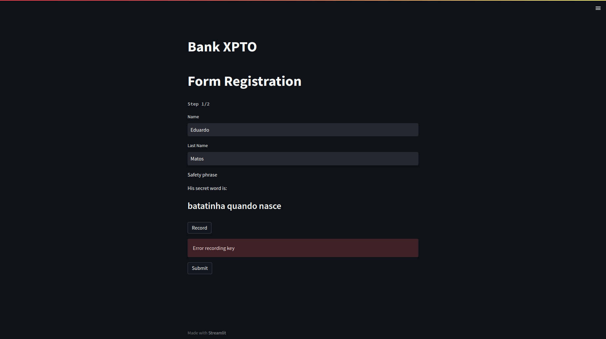
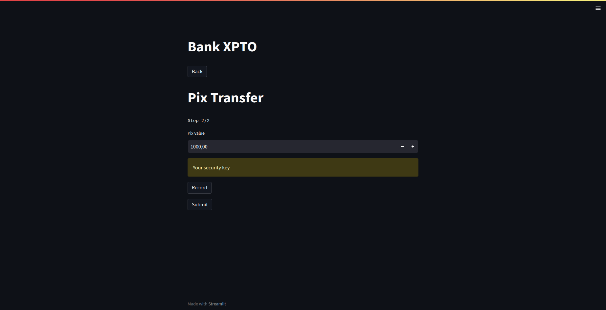
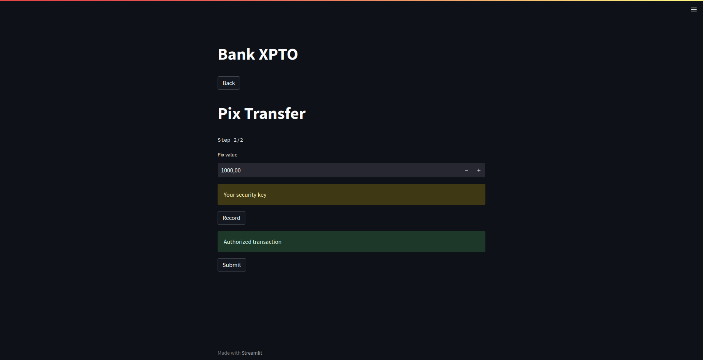
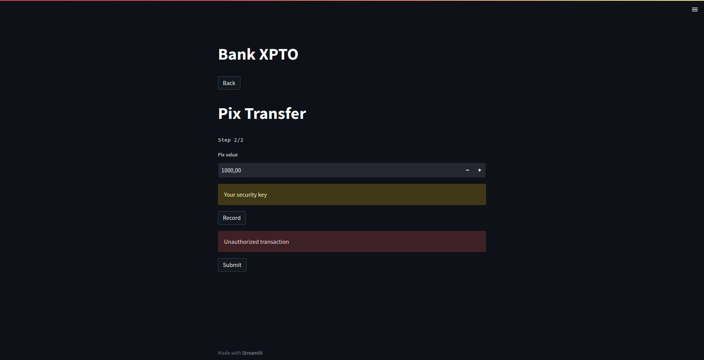
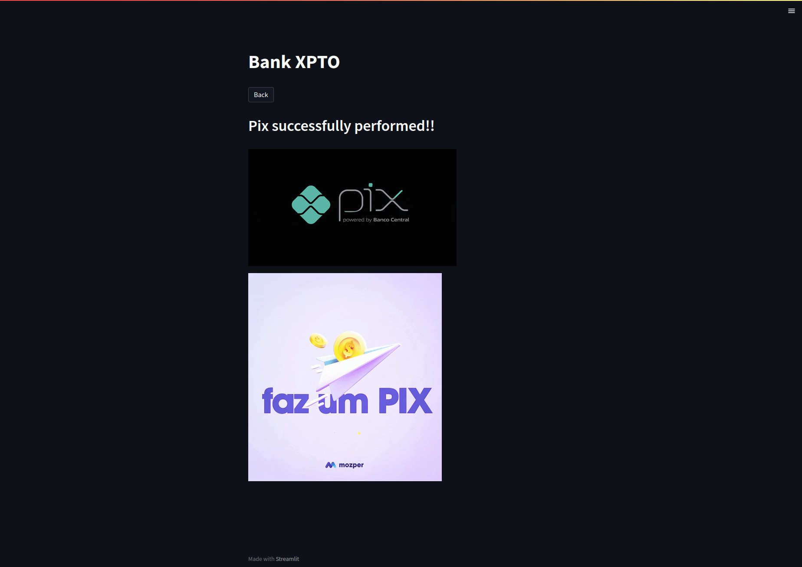

# cybersecurity-fiap-checkpoint-two

## Technology and Resources

- [Python 3.10](https://www.python.org/downloads/release/python-3108/) - **pre-requisite**
- [Streamlit](https://streamlit.io/)

## How to Install

``` shell
pip install -r requirements.txt
```

## How to Run

``` shell
streamlit run run.py
```

## Documentation

### Success in registering



### Fail in registering



### Alert that you need to inform the key



### Success when transaction the pix with the key



### Fail when transaction the pix with the key



### Success page when finalizing the transaction

